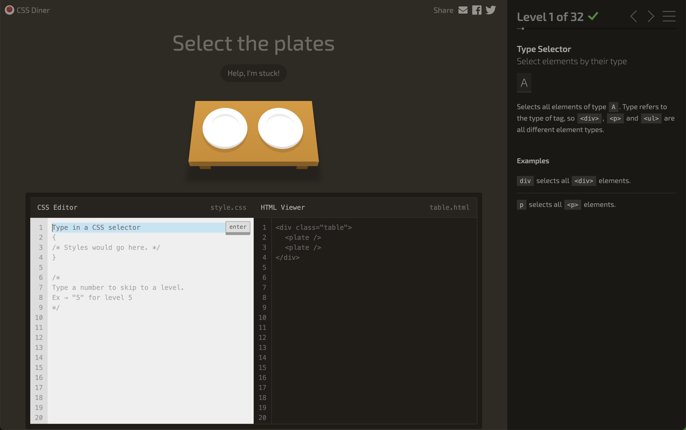
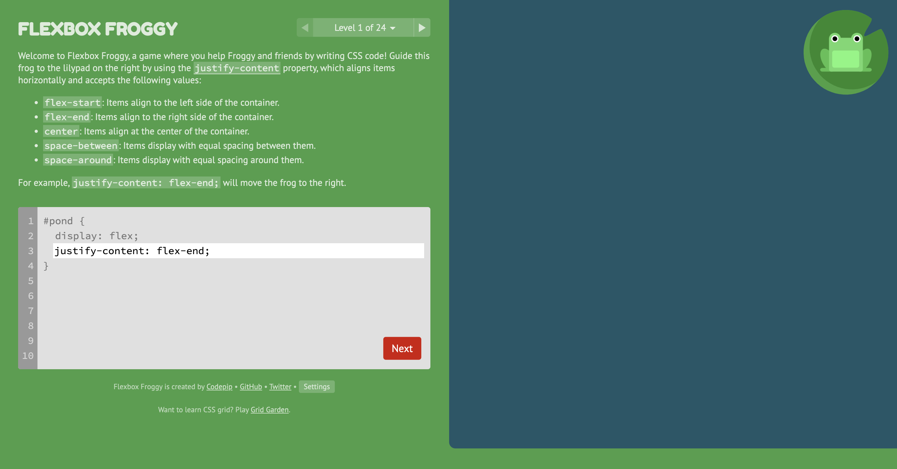

## 介绍几个通过写CSS闯关的小游戏

### 熟悉CSS选择器
- [CSS Diner](https://flukeout.github.io/)：通过写css选择器去选择餐桌上的物品
  

### 熟悉flex布局
- [FlexBox Froggy](http://flexboxfroggy.com/)：一个通过写flex布局代码将所有青蛙移动到荷叶上的小游戏。

### CSS 选择器备忘

