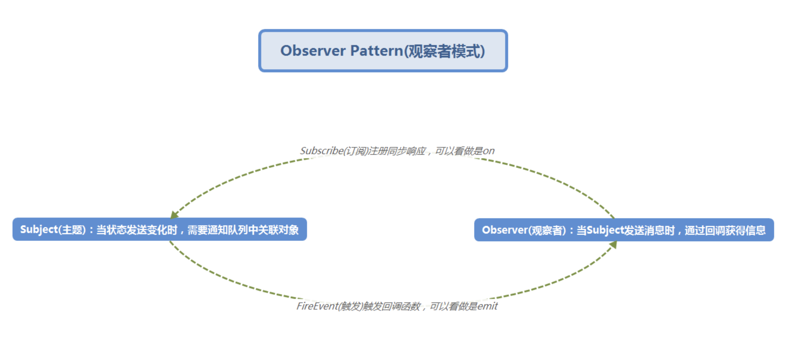
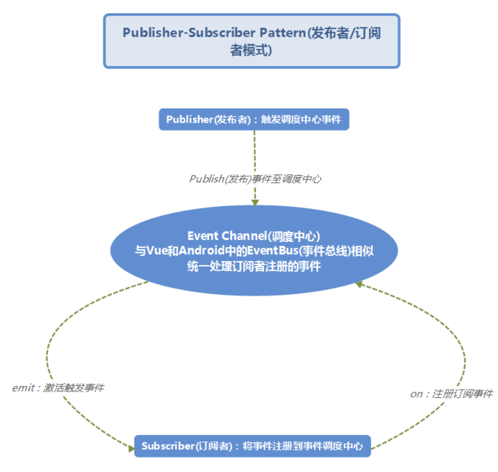

## 观察者模式 与 发布与订阅模式

> 源自 https://blog.csdn.net/time_____/article/details/113770950

### 观察者模式

- `Subject(主题，或者叫被观察者)`: 当状态发生变化时，需要通知队列中关联对象
- `Observer(观察者)`: 当Subject发送消息时，通过回调获得信息

Observer(观察者)将事件（记做fn回调）丢给Subject(被观察者)，然后就开始监视着他的一举一动，当Subject(被观察者)的（异步）任务完成后，同步触发事件fn回调，将消息传输给Observer(观察者)后，完成一个完整的周期。

> 具体实现代码见文件夹

### 发布与订阅模式

- `Subscriber(订阅者)`：将事件注册到事件调度中心（Event Channel或者可以看做EventBus(事件总线)）
- `Publisher(发布者)`：触发调度中心的事件
- `Event Channel(调度中心)`：与Vue和Android中的EventBus(事件总线)相似：得到Publisher(发布者)的消息后，统一处理Subscriber(订阅者)注册的事件

Subscriber(订阅者)通过on将事件注册到Event Channel(调度中心)，并与Event Channel通过回调进行数据传递，当Subscriber(订阅者)触发Event Channel(调度中心)的事件并将数据传递至其中时，调度中心会激活之前与Subscriber(订阅者)建立的联系，通过emit发送数据，订阅者收到数据后完成一个周期。
> 具体实现代码见文件夹

**总结**：发布者/订阅者模式实际上是基于观察者模式上优化实现的，然而其二者的区别还是有的

**观察者模式**：定义对象间的一种一对多的依赖关系，当一个对象的状态发生改变时，所有依赖于它的对象都得到通知并被自动更新；

优点：观察者和被观察者是抽象耦合的，其二者建立了一套触发机制，松耦合；

缺点：二者之间循环依赖，如果关系复杂，如观察者数量过多，还是会造成性能问题，解决方式是避免同步执行造成线程阻塞；

**发布者/订阅者模式**：与观察者模式类似，但是核心区别是发布者与订阅者互相无耦合，并不知道通知与被通知的对方的具体身份，而是将注册的函数放在统一的调度中心进行管理；

- 优点：发布者/订阅者完全解耦，可扩展性高，常应用在分布式，紧耦合服务中；

- 缺点：发布者解耦订阅者，这点既是主要优点，亦是缺点，打个比方，在Socket中，倘若服务端发送消息给客户端，不会在意是否发送成功，此时需要客户端返回接收到了消息才能算是保证了代码的可靠性和可用性。